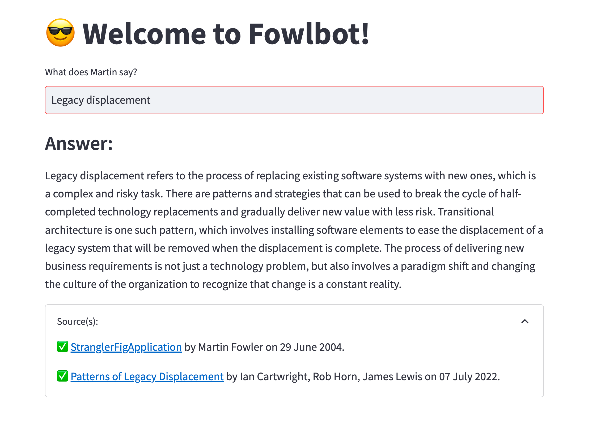
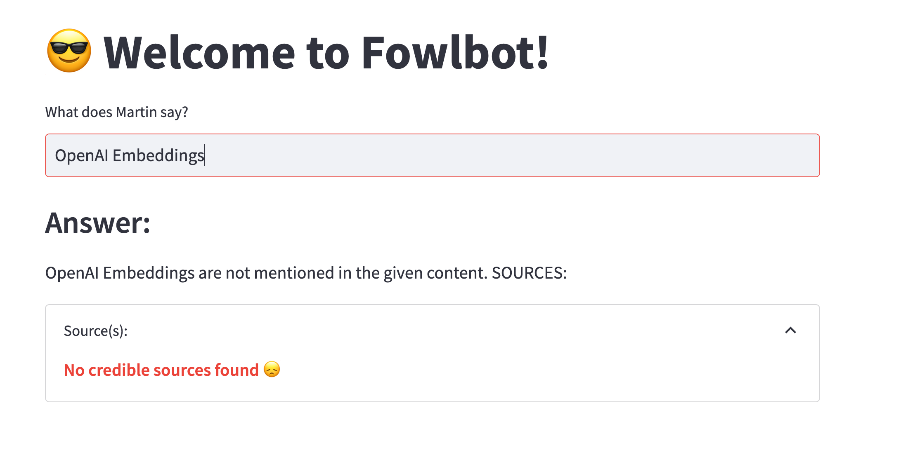
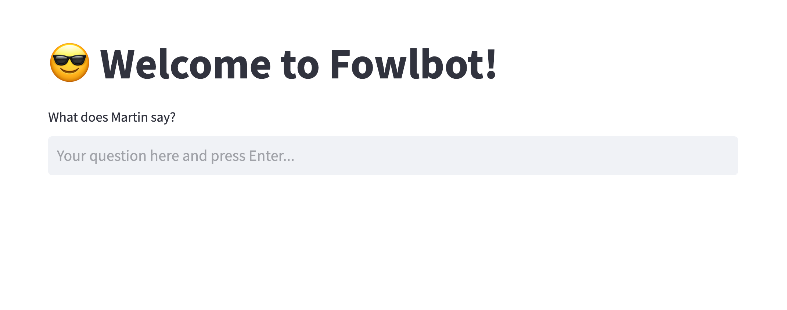
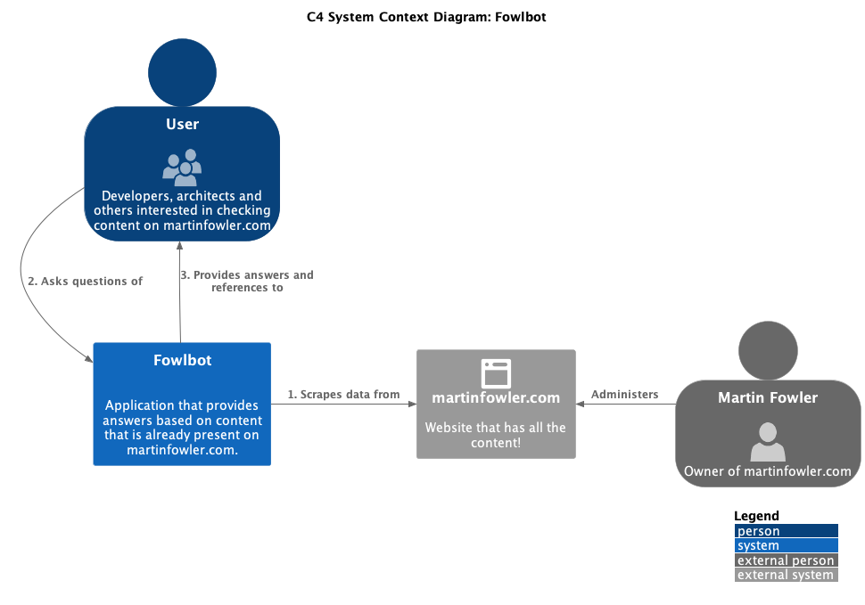
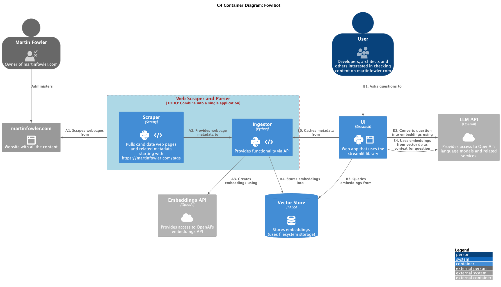

# :sunglasses: Welcome to Fowlbot!
Fowlbot allows you to ask questions of the content on https://martinfowler.com

For example, you can ask it to see what Martin Fowler has had to say on the topic, like so:


If you ask it about content that hasn't appeared on the website, it will tell you so:

## System requirements
[Python](https://www.python.org/) <code>3.11</code> was used for development. It should run reasonably on all platforms that run any recent 3.x distribution.

## How to run locally
1. Fork this repository like so:
```shell
git clone https://github.com/premanandc/fowlbot.git
cd fowlbot
```
2. [Optional] Create a virtual python environment using:
```shell
python3 -m venv venv
```
3. Activate your virtual python environment:
```shell
source ./venv/bin/activate
```
4. Install dependencies:
```shell
pip install -r requirements.txt
```
5. Create a .env file and specify your `OPENAI_API_KEY`. You can obtain one from [OpenAI's website](https://platform.openai.com/account/api-keys). Make sure you understand the OpenAI's [recommended practices for key safety](https://help.openai.com/en/articles/5112595-best-practices-for-api-key-safety) while you are there. You can use the `example.env` file to create your `.env file.
    > Note: You may need to create an account with OpenAI before you can create API keys.
6. Run the ingestor:
```shell
./ingestor.sh
```
7. Run the UI:
```shell
./ui.sh
```
8. If all goes well, you should see the UI pop up on your default browser. If not, you can navigate to it yourself at http://localhost:8501


## Architecture
The C4 system context diagram for Fowlbot is shown below:

The C4 container diagram for Fowlbot is shown below:

It is pertinent to note that two flows are shown. The ingestion flow (labeled using the '**A**' series) and the end user flow (labeled using the '**B**' series).

## Next steps
* Make the chat stateful
* Integrate other websites and content
* Present more analytical information (like the recent articles, the most popular ones, etc.).
* Figure out how to deploy this solution.